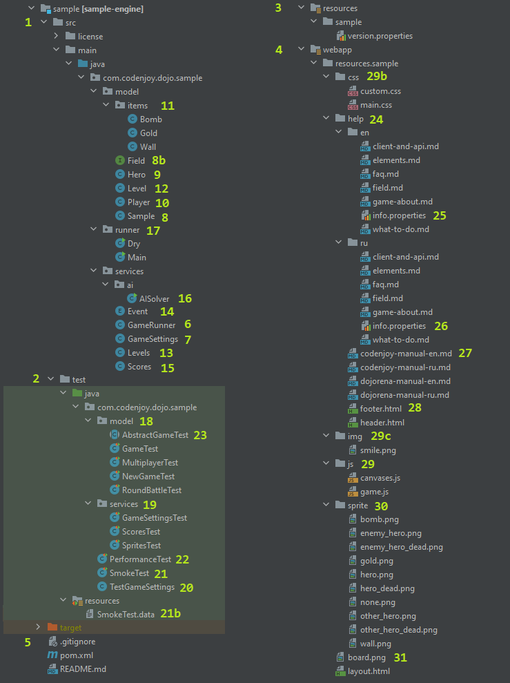

Important disclaimer. Not all games meet the rules described here. But fixes 
are made, and sooner or later it will happen to all games.

Each game is a separate maven project with a separate repository. All games 
inherit `./games/pom.xml` as their parent configure file. All games use as 
dependency the `./games/engine` module, which in itself depends on the 
`./clients/java` module.

The `engine` module contains all the basic classes and interfaces extracted 
from many games to avoid duplication. There are many of them, and they will be 
described separately below.

The `clients/java` module contains all the basic classes needed to participate 
in the game. The participant connects via web-socket from the client containing 
the base classes to write the AI algorithm. They are in this module at once 
for all games. Namely:
1. Element - enum with a list of options for displaying objects on the field 
in the text representation.
2. Board - a class that allows parsing the text representation of the field 
and providing high-level access methods.
3. YourSolver - the player`s AI itself.

All games are divided into two types: graphical and text-based. The game 
templates are the game (module) `./games/sample` for graphical games and 
`./games/sample-text` for text ones. All architectural changes start with 
these games first, and then spread out over all the others in order: `sample`, 
`mollymage`, `clifford`, `verland`, `rawelbbub`, `namdreab`. So far, these 
are the games where all the architectural innovations have been implemented.

The structure of the project is shown in the picture below.



The project consists of production code (1), game tests (2), and resources 
(3), web resources (4) and root files (5): maven configuration of project, 
game client description file for participant, gitignore.

The most important place in the game is the implementation of the abstract 
factory class GameRunner (6). This class instances all important components 
of the game and binds them together.  The game server knows everything about 
the game through this class.

Each game contains a number of settings (7) that the Sensei (Event Facilitator)
can change before or during the game through their admin panel. The settings 
can refer to the game modes: the appearance of specific objects on the field 
in a given amount, the values of points for certain achievements and penalties,
scoring modes, multiplayer game modes, level configurations, and so on. Each 
game implements its own settings, but there are basic settings described in 
`AllSettings`, which can be found in the `engine` module. Some games that 
don't include all the architectural innovations can implement some of the 
settings suggested in `AllSettings`.

```
public class GameSettings extends SettingsImpl implements AllSettings<GameSettings> {
```

The next most important class is `Sample` (8) (its name corresponds to the 
name of the game).  This class contains most of the logic of the game itself; 
it is responsible for the behavior of objects on the field, drawing them, and 
so on. This class is the playing field itself.  The `sample` class of the game 
itself describes all of the artifacts in some detail. I invite you to take a 
journey through the source code.

Quite a bit of the logic is contained in the `Hero` class (9). It encapsulates 
the behavior of the hero on the field and how to control it on behalf of the 
participant. To do this, it implements the `Joystick` interface. Note that 
different helper abstract classes and interfaces can be used from the `engine`
module. This is done for the convenience of writing the game and to avoid
duplication between games. From game to game the inheritance/implementation 
of different helper components may differ. See documentation for each 
class/interface.

The player is represented by the `Player` object (10). Most often it is 
inextricably linked to the `Hero` object (9) and the field (8) on which it is 
initialized. The `Field` interface (8b) is used to avoid the cyclic dependency 
between `Player` / `Hero` and `Sample` (8). One of the main roles of the 
player class is to send events `Event` (14).

Events in the game can be different types: from a trivial `Enum` to an object
with a set of parameters. Events can generate points, which is done in the 
`Score` class (15).

The rest of the game logic is in the `model.items` package (11). This contains 
all the objects that can be on the field. Each object contains its own coordinate
on the field and can be represented in text form. To do this, the `state` 
method uses the `Enum` `Element` located in the `clients/java` module. Most 
often the objects are primitive and `Sample` (8) is responsible for them, but 
if the object has complex behavior and moves on the field, there may already 
be its own implementation.

The class `Level` (12) is responsible for loading the level from the text 
representation. And the class `Levels` (13) contains a list of all game levels 
loaded into `GameSettings` (7).

The class `AISolver` (16) implements the AI, which will run around the field 
with the first registered player on behalf of the game author. It is worth 
taking care that the performance of this class will be high. The performance 
of the game and all its creatures is checked in the `PerformanceTest` (22). 

The `runner` package (17) contains two classes `Dry` to run the game in the 
console for a quick check how everything works, and the `Main` class needed 
to run the game in a simplified version without a server.

Next is a package with the main game tests in the `model` package (18) 
inherited from the `AbstractGameTest` asbtract class (23). Although these 
tests are used as a unit (the main property is that they are fast), they are
integrative and functional. See `docs/testing/smart-assert.md` for the reasons.

In the `service` package (19) you can find several unit test components.

The basic game settings for all tests are set in `TestGameSettings` (20).  
Each test class can override them in its @Before method or method overloading 
the object's settings. Also, any test can define its own specific settings 
if you want them to be highlighted in relation to the test situation.

The `SmokeTest` (21) uses the Approvals approach and is as much of an integration
test of the game as possible. It runs a fairly large number (about 1000) of 
ticks on the field of their occupants pseudo-randomly. It records all board 
states and all events in a flat file. This test is fragile and its results 
must be overwritten after any change in the game. Do not change the file 
`SmokeTest.data` (21b) by hand - the new version, after a visual validation 
of their differences through a diff-tool ide should be copied from `target` 
to the place (21b). This test is the last frontier of testing, and it helps 
in complex refactoring, when you want to make sure nothing is broken, but the
other tests may be insufficient (because code coverage is high - about 80-90% 
for the game, but still not 100%).  

Let's go to the game resources. As we said before, there are two types of 
game resources (3) - what will be used by classes and web resources (4) - 
how the game (or aspects of it) will be played in the browser. A `ample` 
game does not have a full-fledged javascript engine, so everything here is 
very primitive. Now there are at least two games `icancode` and `kata` that 
have full javascript UI. This is handled by the files in the `js` folder (29), 
as well as styles in `css` (29b), images in `img` (29c) and possibly other 
resources that can be added to this level(31).

Special mention should be made of the `sprite` sprites (30), which allow the
game field to be rendered graphically on the browser's canvas component. The 
name of the `png` files corresponds to the name of the `Element` `Enum` in 
the `clients/java` module.

Also stands alone is the `help` (24) folder in which the magic of assembling
the manuals for the game takes place. Because of the large amount of duplicated
information in similar games and the need to maintain it in at least 2 languages,
as well as in two variations (community version and version for dojorena) - 
it was decided to divide the manuals into sections, each of which can be 
redefined by the game individually. All the manuals after generation will be 
collected in the resulting files (27).  And for the community version they 
will be converted into html using `header` and `footer` templates (28).

It is very important to pay attention to the properties files `info.properties` 
(25) and (26) - they contain localized names of game elements `Elements` as 
well as description of settings `GameSettings` (7). The `Elements` for other 
game clients located in `./clients` except `java` are generated automatically
using `java` `Elements` as well as `info.properties` for comments to the constants.

Whew. That's all. Now we can start developing the game.

Bon appetit!

