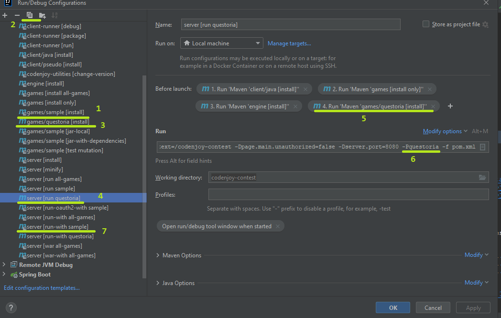

Для создания новой конфигурации для запуска игры в IDE, необходимо выполнить 
следующие действия.

1. Открыть окно настроек запуска (Run -> Edit Configurations...).
2. Выбрать раздел Maven.
3. Клонировать конфигурацию `games/sample [install]` (1) (2)
назвав игру соответственно (3). При этом не забыть поменять root directory проекта
внутри настроек. 
4. Проделать то же самое с конфигурацией `server [run sample]` - он служит для запуска
сервера с одной этой игрой с предварительной сборкой всех зависимых артефактов: 
client/java, games.pom, engine. Тут стоит обратить внимание на изменение билда игры (5)
и параметра `-Pgame` запускающего профиль maven с этой игрой (6). Если есть необходимость
запустить сервер с несколькими играми, то стоит их всех указать в (5), а в (6) 
прописать имена через запятую: `-Pgame1,game2`.
5. То же самое стоит сделать с конфигурацией `server [run-with sample]` - 
он служит для запуска сервера с одной игрой, но без предварительной сборки всех 
зависимостей, что ускоряет процесс. 

Эти ваши кастомные конфигурации не стоит коммитить в репозиторий.