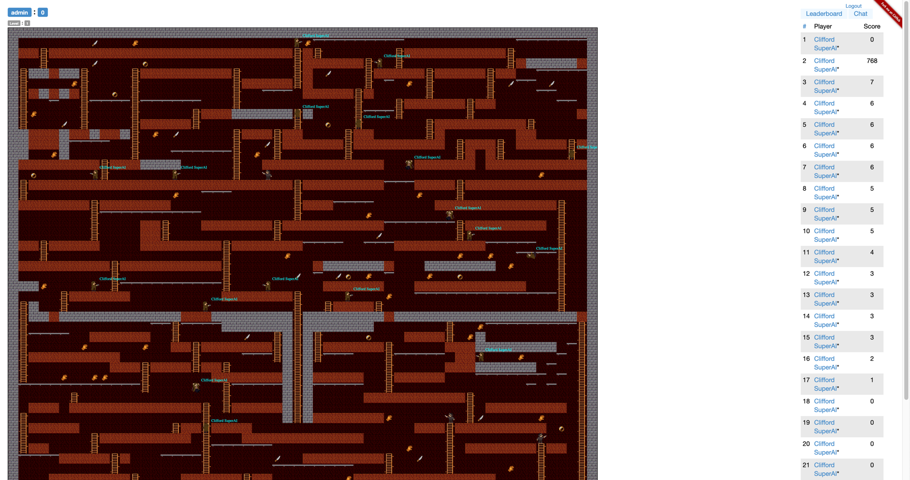

<meta charset="UTF-8">

[Fork me on GitHub](https://github.com/codenjoyme/codenjoy)
# Detective Clifford codenjoy — как играть?
Игровой demo-сервер доступен так же в интернете 24/7 в целях ознакомления http://codenjoy.com/codenjoy-contest

Игра с открытым исходным кодом. Для реализации своей игры, исправления ошибок в текущей и внесения других правок необходимо для начала форкнуть проект. В корне репозитория есть описание в файле Readme.md - там описано, что делать дальше.

По возникающим вопросам, пиши в skype:alexander.baglay или на почту apofig@gmail.com

## В чем суть игры?
Пример карты:

Тебе необходимо написать своего бота для детектива, который обыграет детективов других игроков по очкам. Все играют на одном поле. Детектив может передвигаться по свободным ячейкам во все четыре стороны.

Детектив может вскарабкаться по лестнице (ввер/вниз), а так же передвигаться по трубе (влево/вправо). С трубы можно спрыгнуть вниз. Детектив падает до тех пор, пока не приземлится. Падение с высоты безопасно для детектива.

На своем пути детектив может повстречать улики, врагов, других игроков, черные ходы и зелья.

Детектив так же должен быть внимателен, ведь на пути могут быть оставлены простреленные другими детективами ямы. Ямы со временем зарастают, но если в нее угодить и не успеть выбраться - быть беде! Нет разницы в чью яму угодил детектив - попав в яму он побудет в ней некоторое время и замуруется, штрафные очки за смерть отнимутся и новый детектив появится в произвольном месте на поле. Если же под ямой есть пустота, лестница или труба - детектив проскочит сквозь яму не застряв.

Встав на клетку с уликой, игрок получает за неё очки, а улика, которую подобрал игрок, исчезает с карты. Каждый игровой тик на карте генерируется одинаковое количество улик разного типа - встречаются улики перчатка, нож и кольцо. Количество полученных за улики очков зависит от её типа.

По карте снуют враги - это воры, которые следят за жертвой, и пытаются её догнать. Если злой бот настигает игрока, в этот момент его детектив отправляется в байтовый рай. Но не всё так страшно, уже в следующем игровом тике игрок получит респаун в рандомном месте на игровой карте.

Также, каждый игрок может прострелить ямку в разрушаемой стене (есть еще неразрушаемые). Ямка со временем зарастает. Так можно спастись от вора.

Штрафные очки так же предусмотрены за падение самого героя в свою или чужую ямку из которой он не сможет выбраться. Если ямка чужая - конкурент-участник получит очки.

Если простреленная ямка создает дыру в полу, то детектив может пролететь сквозь нее не застревая. Таким образом можно собирать улики "висящее" в воздухе.

Очки зарабатываются во время собирания улик и устранение конкурентов в ямках.

За каждую новую улику детектив получает немного больше очков, чем за предыдущую. Счетчик сбрасывается при потере героя - выгодно собирать улики и не терять героя. Очки суммируются. Побеждает игрок с большим числом очков (до условленного времени).

Однако, это ещё не всё, и ближе к финалу в игре припасено ещё несколько механик.

В частности, на карте могут появляться черные ходы. Запрыгивая в черный ход, в следующем тике игрок перемещается на место другого, рандомно выбранного черного хода (узнать заранее, в каком месте карты вы окажетесь нельзя). Черные ходы находятся на своих исходных местах в течение нескольких игровых тиков, затем меняют своё расположение случайным образом.

Также, ближе к финалу, на карте начнут появляться специальные зелья... Игрок, подобрав такое зелье (встав на одну клетку с ним), на несколько игровых тиков становится под маскировкой. С этого момента ему становятся не страшны боты-воры. Оказавшись с ними на одной клетке, игрок просто пройдёт сквозь них. Встреча же с другим игроком может быть более коварной. Если игрок-маскировка встаёт на одну клетку с обычным игроком, маскировка убивает бедолагу. При этом, игрок-маскировка получает дополнительные очки, а ушедший в мир иной игрок может, напротив, потерять несколько очков (это мы решим ближе к финалу). В случае же, если на одной клетке встречаются две маскировки, обе остаются живы, при этом не теряют, но и не зарабатывают очков.

Итак, игрок регистрируется на сервере, указывая свой email

Далее необходимо подключиться из кода к серверу через вебсокеты. Это Maven проект и подойдет он для игры на JVM языках. Как его запустить смотри в корне проекта в файле README.txt

Для других языков придется написать свой клиент (а после пошарить с нами на почту: apofig@gmail.com)

Адрес для подключения к игре на сервере http://codenjoy.com:

ws://codenjoy.com:80/codenjoy-contest/ws?user=3edq63tw0bq4w4iem7nb&code=12345678901234567890
Адрес для подключения к игре на сервере, развернутом в локальной сети:

ws://server_ip:server_port/codenjoy-contest/ws?user=3edq63tw0bq4w4iem7nb&code=12345678901234567890
Тут 'user' - id игрока, a 'code' - твой security token, его ты можешь получить из адресной строки браузера после регистрации/логина

После подключения клиент будет регулярно (каждую секунду) получать строку символов — с закодированным состоянием поля. Формат таков

^board=(.*)$
с помощью этого regexp можно выкусить строку доски. Вот пример строки от сервера:

<pre>board=☼☼☼☼☼☼☼☼☼☼☼☼☼☼☼☼☼☼☼☼☼☼☼☼☼☼☼☼☼☼☼          $                 ☼☼###########################H☼☼   $              $        H☼☼H☼☼#☼☼H    H#########H $   H☼☼H $   H    H         H#####H☼☼H#☼#☼#H    H         H      ☼☼H     H~~~~H~~~~~~   H      ☼☼H     H    H  $  H###☼☼☼☼☼☼H☼☼H     H $  H#####H         H☼☼☼###☼##☼##☼H         H###H##☼☼☼###☼      H         H   H  ☼☼☼$  ☼      H   ~~~}~~H   H $☼☼########H###☼☼☼☼     H  ####☼☼        H     $      H      ☼☼###########################H☼☼    $                      H☼☼#######H#######            H☼☼       H~~~~~~~~~~     $   H☼☼       H    ##H   #######H##☼☼       H    ##H          H  ☼☼##H#####    ########H#######☼☼  H     ►   $       H       ☼☼#########H##########H       ☼☼         H          H       ☼☼       $ H~~~~~~~~~~H   $   ☼☼    H######         #######H☼☼    H           $          H☼☼###########################H☼☼☼☼☼☼☼☼☼☼☼☼☼☼☼☼☼☼☼☼☼☼☼☼☼☼☼☼☼☼☼</pre>
Длинна строки равна площади поля. Если вставить символ переноса строки каждые sqrt(length(string)) символов, то получится читабельное изображение поля.

<pre>
☼☼☼☼☼☼☼☼☼☼☼☼☼☼☼☼☼☼☼☼☼☼☼☼☼☼☼☼☼☼
☼          $                 ☼
☼###########################H☼
☼   $              $        H☼
☼H☼☼#☼☼H    H#########H $   H☼
☼H $   H    H         H#####H☼
☼H#☼#☼#H    H         H      ☼
☼H     H~~~~H~~~~~~   H      ☼
☼H     H    H  $  H###☼☼☼☼☼☼H☼
☼H     H $  H#####H         H☼
☼☼###☼##☼##☼H         H###H##☼
☼☼###☼      H         H   H  ☼
☼☼$  ☼      H   ~~~}~~H   H $☼
☼########H###☼☼☼☼     H  ####☼
☼        H     $      H      ☼
☼###########################H☼
☼    $                      H☼
☼#######H#######            H☼
☼       H~~~~~~~~~~     $   H☼
☼       H    ##H   #######H##☼
☼       H    ##H          H  ☼
☼##H#####    ########H#######☼
☼  H     ►   $       H       ☼
☼#########H##########H       ☼
☼         H          H       ☼
☼       $ H~~~~~~~~~~H   $   ☼
☼    H######         #######H☼
☼    H           $          H☼
☼###########################H☼
☼☼☼☼☼☼☼☼☼☼☼☼☼☼☼☼☼☼☼☼☼☼☼☼☼☼☼☼☼☼</pre>

Первый символ строки соответствует ячейке расположенной в левом нижнем углу и имеет координату [0, 0]. В этом примере — позиция героя (символ ►) — [9, 7].

Расшифровка символов:

Пустое место – по которому может двигаться детектив\
`NONE(' ')`

Cтена в которой можно прострелить дырочку слева или справа от детектива (в зависимости от того, куда он сейчас смотрит)\
`BRICK('#')`

Стена со временем зарастает. Когда процес начинается - мы видим таймер\
`PIT_FILL_4('4')`\
`PIT_FILL_3('3')`\
`PIT_FILL_2('2')`\
`PIT_FILL_1('1')`

Неразрушаемая стена - в ней ничего прострелить не получится\
`STONE('☼')`

В момент выстрела мы видим процесс так\
`CRACK_PIT('*')`

Улика нож\
`CLUE_KNIFE('$')`

Улика кольцо\
`CLUE_RING('@')`

Улика перчатка\
`CLUE_GLOVE('&')`

Лестница - по ней можно перемещаться по уровню\
`LADDER('H')`

Труба - по ней так же можно перемещаться по уровню, но только горизонтально\
`PIPE('~')`

Твой детектив в зависимости от того, чем он сейчас занят отображается следующими символами\
`HERO_DIE('Ѡ')`         // Детектив переживает процесс умирания\
`HERO_CRACK_LEFT('Я')`  // Детектив простреливает слева от себя\
`HERO_CRACK_RIGHT('R')` // Детектив простреливает справа от себя\
`HERO_LADDER('Y')`      // Детектив находится на лестнице\
`HERO_LEFT('◄')`        // Детектив бежит влево\
`HERO_RIGHT('►')`       // Детектив бежит вправо\
`HERO_FALL_LEFT(']')`   // Детектив падает, смотря влево\
`HERO_FALL_RIGHT('[')`  // Детектив падает, смотря вправо\
`HERO_PIPE_LEFT('{')`   // Детектив ползёт по трубе влево\
`HERO_PIPE_RIGHT('}')`  // Детектив ползёт по трубе вправо

Тоже твой детектив, но под маскировкой

`HERO_MASK_DIE('x')`         // Детектив-маскировка переживает процесс умирания\
`HERO_MASK_CRACK_LEFT('⊰')`  // Детектив-маскировка простреливает слева от себя\
`HERO_MASK_CRACK_RIGHT('⊱')` // Детектив-маскировка простреливает справа от себя\
`HERO_MASK_LADDER('⍬')`      // Детектив-маскировка находится на лестнице\
`HERO_MASK_LEFT('⊲')`        // Детектив-маскировка бежит влево\
`HERO_MASK_RIGHT('⊳')`       // Детектив-маскировка бежит вправо\
`HERO_MASK_FALL_LEFT('⊅')`   // Детектив-маскировка падает, смотря влево\
`HERO_MASK_FALL_RIGHT('⊄')`  // Детектив-маскировка падает, смотря вправо\
`HERO_MASK_PIPE_LEFT('⋜')`   // Детектив-маскировка ползёт по трубе влево\
`HERO_MASK_PIPE_RIGHT('⋝')`  // Детектив-маскировка ползёт по трубе вправо

Детективы других игроков отображаются так

`OTHER_HERO_DIE('Z')`          // Другой детектив переживает процесс умирания\
`OTHER_HERO_CRACK_LEFT('⌋')`   // Другой детектив простреливает слева от себя\
`OTHER_HERO_CRACK_RIGHT('⌊')`  // Другой детектив простреливает справа от себя\
`OTHER_HERO_LADDER('U')`       // Другой детектив находится на лестнице\
`OTHER_HERO_LEFT(')')`         // Другой детектив бежит влево\
`OTHER_HERO_RIGHT('(')`        // Другой детектив бежит вправо\
`OTHER_HERO_FALL_LEFT('⊐')`    // Другой детектив падает, смотря влево\
`OTHER_HERO_FALL_RIGHT('⊏')`   // Другой детектив падает, смотря вправо\
`OTHER_HERO_PIPE_LEFT('Э')`    // Другой детектив ползёт по трубе влево\
`OTHER_HERO_PIPE_RIGHT('Є')`   // Другой детектив ползёт по трубе вправо

А если детективы других игроков под маскировкой, то так:

`OTHER_HERO_MASK_DIE('⋈')`         // Другой детектив-маскировка переживает процесс умирания\
`OTHER_HERO_MASK_CRACK_LEFT('⋰')`  // Другой детектив-маскировка простреливает слева от себя\
`OTHER_HERO_MASK_CRACK_RIGHT('⋱')` // Другой детектив-маскировка простреливает справа от себя\
`OTHER_HERO_MASK_LEFT('⋊')`        // Другой детектив-маскировка находится на лестнице\
`OTHER_HERO_MASK_RIGHT('⋉')`       // Другой детектив-маскировка бежит влево\
`OTHER_HERO_MASK_LADDER('⋕')`      // Другой детектив-маскировка бежит вправо\
`OTHER_HERO_MASK_FALL_LEFT('⋣')`   // Другой детектив-маскировка падает, смотря влево\
`OTHER_HERO_MASK_FALL_RIGHT('⋢')`  // Другой детектив-маскировка падает, смотря вправо\
`OTHER_HERO_MASK_PIPE_LEFT('⊣')`   // Другой детектив-маскировка ползёт по трубе влево\
`OTHER_HERO_MASK_PIPE_RIGHT('⊢')`  // Другой детектив-маскировка ползёт по трубе вправо

Вражеские детективы других игроков отображаются так:

`ENEMY_HERO_DIE('Ž')`          // Вражеский детектив переживает процесс умирания\
`ENEMY_HERO_CRACK_LEFT('')`   // Вражеский детектив простреливает слева от себя\
`ENEMY_HERO_CRACK_RIGHT('')`  // Вражеский детектив простреливает справа от себя\
`ENEMY_HERO_LADDER('Ǔ')`       // Вражеский детектив находится на лестнице\
`ENEMY_HERO_LEFT('❫')`         // Вражеский детектив бежит влево\
`ENEMY_HERO_RIGHT('❪')`        // Вражеский детектив бежит вправо\
`ENEMY_HERO_FALL_LEFT('⋥')`    // Вражеский детектив падает, смотря влево\
`ENEMY_HERO_FALL_RIGHT('⋤')`   // Вражеский детектив падает, смотря вправо\
`ENEMY_HERO_PIPE_LEFT('Ǯ')`    // Вражеский детектив ползёт по трубе влево\
`ENEMY_HERO_PIPE_RIGHT('Ě')`   // Вражеский детектив ползёт по трубе вправо

А если вражеские детективы других игроков под маскировкой, то так:

`ENEMY_HERO_MASK_DIE('⧓')`         // Вражеский детектив-маскировка переживает процесс умирания\
`ENEMY_HERO_MASK_CRACK_LEFT('⇢')`  // Вражеский детектив-маскировка простреливает слева от себя\
`ENEMY_HERO_MASK_CRACK_RIGHT('⇠')` // Вражеский детектив-маскировка простреливает справа от себя\
`ENEMY_HERO_MASK_LEFT('⧒')`        // Вражеский детектив-маскировка находится на лестнице\
`ENEMY_HERO_MASK_RIGHT('⧑')`       // Вражеский детектив-маскировка бежит влево\
`ENEMY_HERO_MASK_LADDER('≠')`      // Вражеский детектив-маскировка бежит вправо\
`ENEMY_HERO_MASK_FALL_LEFT('⌫')`   // Вражеский детектив-маскировка падает, смотря влево\
`ENEMY_HERO_MASK_FALL_RIGHT('⌦')`  // Вражеский детектив-маскировка падает, смотря вправо\
`ENEMY_HERO_MASK_PIPE_LEFT('❵')`   // Вражеский детектив-маскировка ползёт по трубе влево\
`ENEMY_HERO_MASK_PIPE_RIGHT('❴')`  // Вражеский детектив-маскировка ползёт по трубе вправо

Так же и враг-вор

`ROBBER_LADDER('Q')`        // Вор на лестнице\
`ROBBER_LEFT('«')`          // Вор направлен влево\
`ROBBER_RIGHT('»')`         // Вор направлен вправо\
`ROBBER_PIPE_LEFT('<')`     // Вор ползет по трубе влево\
`ROBBER_PIPE_RIGHT('>')`    // Вор ползет по трубе вправо\
`ROBBER_PIT_LEFT('⍇')`      // Вор в яме направлен влево\
`ROBBER_PIT_RIGHT('⍈')`     // Вор в яме направлен вправо

Черный ход - позволяет скрыто перемещаться в иное место на карте\
`BACKWAY('⊛')`

Маскировочное зелье - наделяют детектива дополнительными способностями\
`MASK_POTION('S')`

Игра пошаговая, каждую секунду сервер посылает твоему клиенту состояние обновленного поля на текущий момент и ожидает ответа команды герою. За следующую секунду игрок должен успеть дать команду герою. Если не успел — детектив стоит на месте.

Команд несколько: **UP**, **DOWN**, **LEFT**, **RIGHT** – приводят к движению героя в заданном направлении на 1 клетку; **ACT** - прострелить дырку в направлении, куда смотрит детектив. Команды движения можно комбинировать с командой **ACT**, разделяя их через запятую – это укажет в какую сторону надо прострелить дырку (без передвижения детектива). Порядок **(LEFT, ACT)** или **(ACT, LEFT)** - не имеет значения - будет прострелена дырка слева. Если игрок будет использовать только одну команду **ACT** то дырка прострелитсь в направлении, куда смотрит детектив.

Если вдруг детектив попал в ловушку и выбраться оттуда он не может - вызови команду **ACT(0)** и детектив совершит акт суицида, после чего он появится в новом месте.

Первоочередная задача – написать websocket клиента, который подключится к серверу. Затем заставить героя слушаться команды. Таким образом, игрок подготовится к основной игре. Основная задача – вести осмысленную игру и победить.

Параметры будут настраиваться по ходу игры. Значения по-умолчнию представлены в таблице ниже:

<table>
    <thead>
        <tr>
            <th>Событие</th>
            <th>Очки</th>
        </tr>
    </thead>
    <tbody>
        <tr>
            <td>Количество Маскировочных зелье на карте</td>
            <td class="score-value">0</td>
        </tr>
        <tr>
            <td>Время действия маскировочного зелье (тиков)</td>
            <td class="score-value">15</td>
        </tr>
        <tr>
            <td>Количество черных ходов на карте</td>
            <td class="score-value">0</td>
        </tr>
        <tr>
            <td>Количество тиков до изменения положения черных ходов</td>
            <td class="score-value">10</td>
        </tr>
        <tr>
            <td>Количество ботов-преследователей</td>
            <td class="score-value">5</td>
        </tr>
        <tr>
            <td>Количество улик перчатка на карте</td>
            <td class="score-value">40</td>
        </tr>
        <tr>
            <td>Очки за улику перчатка</td>
            <td class="score-value">1</td>
        </tr>
        <tr>
            <td>Инкремент очков за последующие собранные улики перчатки в серии без смертей</td>
            <td class="score-value">1</td>
        </tr>
        <tr>
            <td>Количество улик нож на карте</td>
            <td class="score-value">20</td>
        </tr>
        <tr>
            <td>Очки за улику нож</td>
            <td class="score-value">2</td>
        </tr>
        <tr>
            <td>Инкремент очков за последующие собранные улики ножи в серии без смертей</td>
            <td class="score-value">1</td>
        </tr>
        <tr>
            <td>Количество улик кольцо на карте</td>
            <td class="score-value">10</td>
        </tr>
        <tr>
            <td>Очки за улику кольцо</td>
            <td class="score-value">5</td>
        </tr>
        <tr>
            <td>Инкремент очков за последующие собранные улики кольцо в серии без смертей</td>
            <td class="score-value">1</td>
        </tr>
        <tr>
            <td>Пенальти за смерть</td>
            <td class="score-value">1</td>
        </tr>
        <tr>
            <td>Очки за убийство другого игрока (под маскировкой или при закапывании)</td>
            <td class="score-value">10</td>
        </tr>
        <tr>
            <td>Пенальти за суицид</td>
            <td class="score-value">10</td>
        </tr>
    </tbody>
</table>